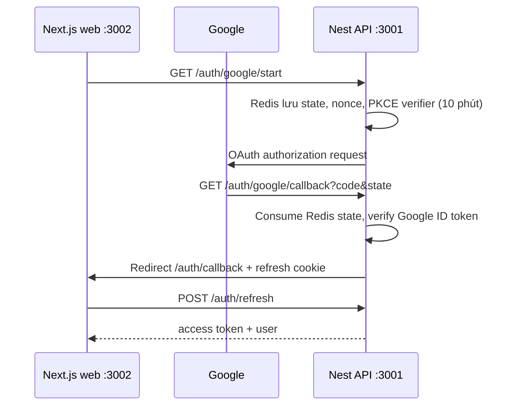

# Authentication specification

## Mục tiêu

Inventory API hỗ trợ email/mật khẩu và Google OpenID Connect. Sau khi xác thực, cả hai cách đều cấp access token của Inventory API; các endpoint nghiệp vụ chỉ dùng Bearer token này.

## Luồng email/mật khẩu

1. `POST /api/v1/auth/register` nhận email và mật khẩu tối thiểu 12 ký tự, tạo user role `customer`.
2. `POST /api/v1/auth/login` trả `accessToken` trong JSON và refresh token trong cookie `inventory_refresh` (`HttpOnly`, `SameSite=Lax`, path `/api/v1/auth`).
3. Client gửi `Authorization: Bearer <accessToken>` cho API cần đăng nhập; access token hết hạn sau 15 phút.
4. `POST /api/v1/auth/refresh` dùng cookie để rotate refresh token, trả access token mới và đặt cookie mới. Refresh token sống 7 ngày.
5. `POST /api/v1/auth/logout` revoke refresh token hiện tại và xóa cookie. `GET /api/v1/auth/me` trả user của Bearer token.

Refresh token chỉ lưu SHA-256 hash trong PostgreSQL. Khi một refresh token đã bị revoke bị dùng lại, backend revoke tất cả token cùng `family_id`.

## Luồng Google SSO

Google callback chính xác là `http://localhost:3004/api/v1/auth/google/callback`. Google Cloud phải thêm URI này vào **Authorized redirect URIs**. Gateway proxy callback vào API tại port 3001. Backend xác minh chữ ký, issuer, audience, expiry, nonce và `email_verified`. `sub` của Google là identity key; email không phải identity key.

Nếu email Google đã thuộc tài khoản password, login Google trả 409. User đăng nhập password trước, gọi `POST /api/v1/auth/google/link/start` với Bearer token rồi hoàn tất OAuth để liên kết rõ ràng.

## Frontend và Axios

Frontend chạy ở `http://localhost:3002`; backend phải có `APP_ORIGIN=http://localhost:3002`.

- `localStorage` giữ `user` và access token; Redux Toolkit giữ bản session đang dùng trong UI. Bootstrap chỉ hydrate Redux nếu token còn hạn, không gọi refresh khi đổi route.
- Axios request interceptor đọc `exp` của JWT. Token còn dưới 5 giây mới chờ một `refreshPromise` chung, lưu session mới vào Redux và `localStorage`, rồi gửi request.
- Axios response interceptor xử lý 401 bằng refresh và retry một lần.
- Refresh token không được lưu trong Redux hay `localStorage`; browser tự gửi cookie HttpOnly với `withCredentials: true`.
- Logout xóa session local kể cả khi request mạng thất bại. Vì access token nằm trong `localStorage`, frontend phải tránh render HTML không tin cậy và duy trì CSP để giảm nguy cơ XSS đánh cắp token.

## Dữ liệu và biến môi trường

| Bảng | Mục đích |
|---|---|
| `users` | Email, password hash nullable, role |
| `auth_identities` | Google `provider + subject` liên kết với user |
| `refresh_tokens` | Token hash, family, expiry, revoke state |

Biến cần có: `JWT_SECRET`, `JWT_ISSUER`, `JWT_AUDIENCE`, `APP_ORIGIN`, `GOOGLE_CLIENT_ID`, `GOOGLE_CLIENT_SECRET`, `GOOGLE_REDIRECT_URI`. Không commit `.env`.

Xem thêm [Google SSO setup](GOOGLE_SSO.md) để tạo OAuth client, và [frontend README](../apps/web/README.md) để chạy Next.js client.
