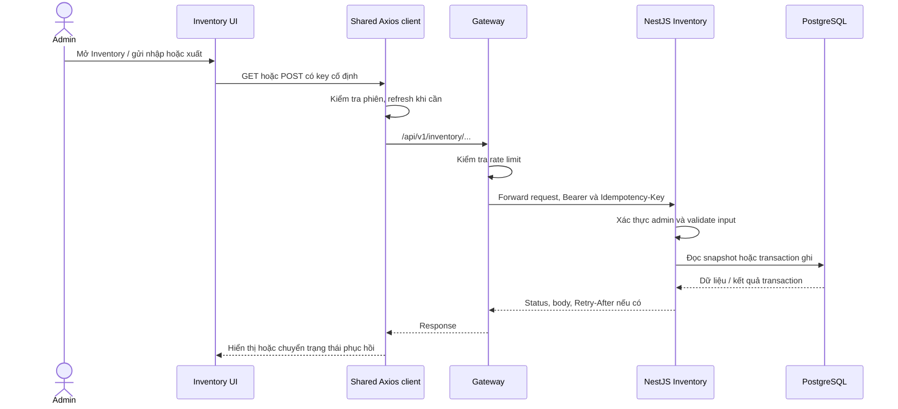

# Spec giải thích các flow Inventory

Ngày đối chiếu code: **07/10/2026**.

Cập nhật theo yêu cầu hiện tại: nút Inventory mở trang `/inventory/[productId]` có tồn hiện tại, bảng lịch sử và form nhập/xuất; không mở drawer. Các spec feature được liên kết bên dưới là tài liệu của phạm vi trước thay đổi này.

Tài liệu này giải thích hành vi đang được triển khai để đọc code và thực hành. Đây là tài liệu bổ sung, không thay thế [spec nghiệp vụ Inventory](INVENTORY_SPEC.md) hoặc [spec frontend](../../../specs/003-frontend-inventory/vi/spec.vi.md), và không phải kết quả chạy workflow Spec Kit. Mô tả từ code không đồng nghĩa mọi tình huống đã được kiểm chứng runtime.

## 1. Inventory quản lý những gì?

Một kho, nhiều sản phẩm. Mỗi sản phẩm có tồn hiện tại và lịch sử nhập/xuất. `RECEIPT` cộng tồn; `ISSUE` trừ tồn. Lịch sử là các sự kiện đã ghi nhận, không có nút sửa/xóa. Sản phẩm `INACTIVE` vẫn được xem, nhập và xuất.

Ba khái niệm cần phân biệt:

| Khái niệm | Vai trò |
|---|---|
| Balance | Số lượng tồn hiện tại của sản phẩm |
| Movement | Một sự kiện nhập/xuất: số lượng, tồn trước/sau, người thực hiện, lý do, thời gian |
| Operation / attempt | Operation là ý định gửi một giao dịch với một key/body cố định; attempt là một lần gửi hoặc thử lại operation đó |

Ví dụ: tồn 0 → nhập 10 → tồn 10 → xuất 3 → tồn 7. Xuất thêm 8 bị từ chối; tồn vẫn 7 và lịch sử vẫn chỉ có hai movement thành công.

## 2. Tổng quan đường đi



Frontend dùng shared Axios client, đi qua rewrite `/api/v1` đến Gateway. API quyết định quyền và nghiệp vụ; frontend không tự cập nhật tồn trong DB. Gateway không thực hiện phép cộng/trừ tồn.

## 3. Flow vào trang và kiểm tra quyền

1. `SessionBootstrap` khôi phục phiên vào Redux. Khi `initialized` chưa sẵn sàng, Inventory hiển thị loading và chưa tải dữ liệu inventory.
2. Không có user và không giữ operation: chuyển về `/login`.
3. User là `customer`: hiển thị không có quyền; không tải catalog, tồn và lịch sử.
4. User là `admin`: cho phép tải dữ liệu khi trang đang active.
5. Nếu operation đang thuộc admin A nhưng phiên hiện tại là B: ẩn dữ liệu và nội dung operation. Không cho B tiếp tục gửi operation của A.

Frontend gate giúp điều khiển UI. Mọi endpoint API, kể cả replay, vẫn kiểm tra Bearer JWT và quyền admin.

## 4. Flow tải danh sách tồn kho

- `useInventoryData` khởi tạo `page=1`, `size=10`, gọi `GET /inventory?page=1&limit=10`.
- API đọc toàn bộ catalog, gồm ACTIVE/INACTIVE, ghép balance. Chưa có dòng balance được biểu diễn là tồn 0; GET không tạo dòng balance.
- Table hiển thị tên, SKU, trạng thái, tồn và nút Inventory. Danh sách sắp xếp theo product ID tăng dần.
- Đổi trang gọi GET mới. Đổi page size về 10/20/50/100 thì reset page về 1.
- Trang vượt cuối trả danh sách rỗng và giữ total. UI không tự chuyển về trang cuối.
- Khi lỗi đọc, hiển thị thông báo và nút thử lại GET. Không thay lỗi bằng tồn 0.

`useInventoryResource` giữ trạng thái `loading`, `ready` hoặc `error`. Query identity gồm actor, trang/kích thước và version; response của query cũ không được dùng cho query hiện tại. Cleanup abort request cũ. API trả items/count trong cùng snapshot cho từng request, không cam kết nhiều request có cùng snapshot.

Form tìm kiếm gửi `q`, `status`, `createdFrom`, `createdTo` đến server cùng `page/limit`. Áp dụng bộ lọc reset page về 1; Table không giả lập tìm kiếm bằng cách lọc một trang đã tải.

## 5. Flow mở trang chi tiết, xem tồn và lịch sử

1. Bấm Inventory trên một hàng điều hướng đến `/inventory/:productId`.
2. Layout chung giữ bộ lọc, Form instance và phân trang catalog khi chuyển giữa danh sách/chi tiết. Trang chi tiết có nút “Quay lại danh sách”; nút Inventory ở sidebar cũng quay lại danh sách.
3. Trang chi tiết tải riêng `GET /inventory/:productId` và `GET /inventory/:productId/movements?page=1&limit=20`. Không tải catalog khi đang ở trang chi tiết.
4. Tồn và lịch sử có loading/error/nút retry độc lập. Lỗi history không chặn nhập/xuất nếu tồn hiện tại đã tải thành công.
5. History phân trang riêng; đổi trang history không đổi trang catalog. Thứ tự là `createdAt DESC, id DESC`; UI hiển thị UTC.
6. Rời trang chi tiết xóa draft/operation và reset phân trang lịch sử. Quay lại danh sách tải GET mới, giữ bộ lọc và trang catalog trong cùng phiên layout. Reload toàn trang khởi tạo lại state local.
7. Mở trực tiếp URL chi tiết hoặc reload URL đó vẫn tải tồn/history theo productId trên route, không cần chọn hàng trước. Form bị chặn submit tới khi tồn ready.

Movement lưu dữ kiện lịch sử bất biến. Tên/SKU/trạng thái đi kèm history được lấy từ catalog hiện tại, không phải snapshot tên sản phẩm tại lúc giao dịch. Product không tồn tại trả `404 PRODUCT_NOT_FOUND`; product chưa có movement trả history rỗng. Bảng history và form nằm cạnh nhau trên màn rộng, xếp dọc trên màn hẹp.

## 6. Flow gửi nhập/xuất

### 6.1. Validate và tạo operation

Form mặc định `RECEIPT`. Chỉ được gửi khi tồn của sản phẩm trên route ở trạng thái `ready`, user là admin và không có operation chưa kết thúc.

| Field | Quy tắc |
|---|---|
| `type` | Chính xác `RECEIPT` hoặc `ISSUE` |
| `quantity` | JSON number nguyên từ 1 đến 1.000.000 |
| `reason` | Trim khoảng trắng đầu/cuối; 1–500 Unicode code point |

Frontend kiểm tra tại form và trước khi tạo operation. API validate lại, từ chối field lạ; client không được tự gửi actor, timestamp hoặc balance.

`createMovement` tạo UUID key một lần, chốt actor/product, freeze payload đã trim và tạo AbortController. `operationRef` được đặt trước chuỗi interceptor async để chặn gửi trùng đồng thời. Mỗi lần thử có attempt identity riêng.

### 6.2. Gửi request

```http
POST /api/v1/inventory/:productId/movements
Idempotency-Key: <UUID của operation>
Content-Type: application/json

{"type":"RECEIPT","quantity":10,"reason":"Nhập hàng"}
```

Timeout POST phía web là 15 giây. Form bị khóa trong khi operation chưa terminal. POST bắt đầu từ hành động submit/retry; effect và timer không tự gửi movement. Shared Axios có thể refresh phiên và replay một lần sau 401 của request được bảo vệ; replay này giữ nguyên key/body.

Axios kiểm tra signal, deadline, phiên admin và actor trước/sau refresh, trước replay và ngay tại adapter dispatch. Refresh về một admin khác không được dùng để gửi operation cũ.

### 6.3. Transaction ở API

1. Xác thực và validate UUID/query/body/key. Scope idempotency là `(actorId, inventory.movement.v1, key)`.
2. Thử advisory transaction lock theo scope, không chờ. Chưa lấy được lock → `409 IDEMPOTENCY_IN_PROGRESS` và `Retry-After: 1`.
3. Có result còn hạn và fingerprint khớp → trả nguyên status/body cũ. Khác fingerprint → `409 IDEMPOTENCY_KEY_REUSED`.
4. Operation mới: kiểm tra product, tạo balance 0 khi cần, khóa dòng balance bằng `FOR UPDATE` và tính tồn sau.
5. Tồn sau phải từ 0 đến 2.147.483.647. Vi phạm → rollback phần thay đổi balance về savepoint; chỉ lưu result lỗi nghiệp vụ.
6. Thành công: update balance, insert movement, lưu result idempotency rồi commit cùng transaction.

Fingerprint gồm operation, productId chuẩn hóa, type, quantity và reason đã trim. Lock balance bảo vệ các key khác nhau cùng ghi một sản phẩm; key lock bảo vệ các lần gửi cùng một operation.

`201`, `404 PRODUCT_NOT_FOUND` của POST hợp lệ và hai lỗi stock 409 được lưu để replay. Result hết hạn sau 24 giờ từ hoàn tất, replay không gia hạn. Lỗi validation/auth, key conflict, rate limit và lỗi transport không được cache như một kết quả nghiệp vụ hoàn tất.

## 7. Flow nhận kết quả và refresh UI

Frontend chỉ công nhận `201` khi movement khớp actor/product/type/quantity/reason đã gửi, có movement ID và tồn trả về khớp `balanceAfter`. Response không nhận diện được được xử lý như chưa rõ kết quả.

| Kết quả terminal | UI làm gì? |
|---|---|
| Thành công / replay thành công | Giữ trang chi tiết, reset quantity/reason, giữ type; reload catalog, tồn và history; history về page 1 |
| Stock rejection 409 | Reset quantity/reason, reload tồn; chờ tồn ready trước giao dịch mới |
| Product missing 404 | Reload tồn để hiện lỗi; không tự tạo giao dịch mới khi tồn chưa ready |
| INVALID_INPUT 400, chưa có uncertainty trước đó | Giữ draft và hiển thị lỗi trường để sửa |
| 401/403 từ server, chưa có uncertainty trước đó | Kết thúc bằng access rejection; có thể xóa phiên nếu response thuộc đúng token/actor hiện tại |

Refresh GET thất bại sau một POST thành công không làm POST thất bại trở lại. Nút retry đọc chỉ gửi GET; không được nhập/xuất lại chỉ vì Table tải lỗi.

Terminal result chỉ áp dụng một lần cho đúng actor và sản phẩm đang chọn. Response muộn của operation đã discard hoặc attempt cũ không được cập nhật UI.

## 8. Flow lỗi, recovery và retry

| Trạng thái operation | Ý nghĩa |
|---|---|
| `sending` | Một attempt đang gửi; chưa cho attempt khác |
| `in_progress` | Server đang xử lý cùng key, chưa có uncertainty trước đó |
| `retryable` | Rate limit hoặc INVENTORY_BUSY; chưa có uncertainty trước đó |
| `uncertain` | Chưa xác định được kết quả; hoặc uncertainty trước đó chưa được giải quyết |
| `blocked` | Chặn bởi key conflict hoặc điều kiện phiên/deadline cục bộ |
| `terminal` | Có kết quả kết thúc đã nhận diện |

Timeout, mất response, 500, Gateway 502, 503 không nhận diện và lỗi ngoài các nhánh đã biết chuyển sang `uncertain`. Request có thể đã commit dù browser báo lỗi.

`priorUncertain` là điểm quan trọng: sau khi từng mất kết quả, một lỗi 400/401/403 hoặc 429/INVENTORY_BUSY của lần retry không chứng minh lần trước chưa commit. Operation tiếp tục bị giữ. Matching `201`, `404` hoặc stock 409 mới giải quyết kết quả nghiệp vụ đang giữ.

Bấm “Thử lại cùng thao tác”:

1. Kiểm tra không sending/discarded/terminal, không key conflict/deadline, đã hết thời gian chờ và vẫn đúng admin gốc.
2. Gửi một attempt mới với **cùng key, cùng product, cùng frozen payload**. Không đọc draft để tạo payload retry.
3. Tôn trọng `Retry-After` dạng giây hoặc HTTP date. Fallback cho nhánh retryable/uncertain là 1/2/4/8/16/30 giây cộng jitter 0–250 ms, tối đa 30 giây; in-progress không có header chờ 1 giây.
4. Timer chỉ cập nhật countdown. Không có vòng tự POST retry.

Frontend đặt hạn ban đầu khi tạo operation, rồi chốt lại 24 giờ từ lần dispatch đầu tiên. Khi hết hạn, nút retry bị vô hiệu hóa và dispatch guard tiếp tục chặn; không nhất thiết có timer chuyển status sang `blocked`. Hạn frontend này khác mốc expiry server tính từ lúc hoàn tất. Sau expiry server có thể coi key là lệnh mới, nên frontend không gửi lại operation hết hạn.

Ví dụ mất response: nhập 10 đã commit → browser timeout → bấm retry cùng key → API replay movement cũ → tồn vẫn 10, không thành 20.

## 9. Flow mất phiên và khôi phục đúng admin

Nếu chưa đăng nhập nhưng còn operation, trang không tự redirect bỏ recovery; hiển thị hành động đăng nhập có guard rời trang. Nếu đổi actor hoặc mất quyền, ẩn catalog/history/payload. Latch của attempt vẫn được giải phóng khi attempt kết thúc, độc lập với quyền UI lúc đó.

Kết quả đến khi mất quyền được giữ nội bộ, không hiển thị dữ liệu bảo vệ. Nếu cùng admin gốc được khôi phục tại chỗ và component chưa bị discard, terminal result được áp dụng một lần; kết quả chưa rõ có thể retry cùng key. Khôi phục phiên không tự POST.

Refresh thất bại trước dispatch và sau POST bị 401 được ghi nhận khác nhau. Lỗi cục bộ chưa gửi không tự được coi là kết quả nghiệp vụ; operation được giữ để khôi phục đúng phiên. Điều hướng sang login qua guard có thể discard operation theo lựa chọn người dùng; đây khác với khôi phục phiên tại chỗ.

## 10. Flow quay lại danh sách và rời trang

Nút “Quay lại danh sách”, menu Inventory/Dashboard, logout và login đều qua `requestDeparture` khi có operation chưa terminal. Không còn thao tác đóng drawer, mask hoặc Escape.

- **Ở lại**: giữ operation, key/body và draft.
- **Rời**: kiểm tra operation identity lúc xác nhận; abort signal, đánh dấu discarded và bỏ operation trước khi chạy hành động rời. Modal xác nhận rời không được discard nhầm một operation mới; đây chỉ là guard thao tác, không phải màn xem chi tiết.
- Khi operation terminal hoặc chỉ có draft chưa gửi: không yêu cầu xác nhận operation.
- `beforeunload` chỉ được gắn khi có operation chưa terminal; lời cảnh báo do browser quyết định hiển thị.
- Đổi route trong Inventory, `pagehide` hoặc unmount bỏ operation và hủy read/request đang giữ. Browser Back/Forward không có router interception hay history sentinel; khi route thực sự đổi, operation cũ bị discard. Trở lại từ bfcache qua `pageshow.persisted` xóa state cũ, mở lại fresh GET nếu được phép.

Abort phía browser **không chứng minh rollback DB**. Sau khi rời giữa chừng, phải xem history trước khi nhập/xuất lại. Operation/key không lưu vào localStorage; reload không khôi phục operation để POST tiếp.

## 11. Đọc code theo thứ tự nào?

Tất cả path frontend bên dưới tính từ `apps/web/components/inventory/`:

| File / folder | Trách nhiệm |
|---|---|
| `inventory-management.tsx` | Ghép auth, selection, data, operation, departure và layout |
| `inventory-table.tsx` | Danh sách tồn, phân trang, chọn sản phẩm |
| `inventory-details.tsx` | Trang tồn chi tiết, history, form và recovery UI |
| `hooks/use-inventory-data.ts` | Query/pagination/version và refresh sau movement |
| `hooks/use-inventory-resource.ts` | GET lifecycle, abort và query identity |
| `hooks/use-inventory-operation.ts` | Operation/attempt latch, submit/retry, terminal và ownership |
| `hooks/use-inventory-departure.ts` | Modal guard và lifecycle rời/quay lại trang |
| `api/inventory-api.ts` | Các GET/POST, endpoint, signal, key và metadata dispatch |
| `api/api-types.ts` | Type request, query params và response của từng endpoint |
| `services/movement-command.ts` | Tạo frozen operation, gọi API và nhận diện success |
| `services/movement-error.ts` | Phân loại lỗi, giữ uncertainty và tính retry |
| `types/`, `constants/` | Contract TypeScript và giá trị nghiệp vụ dùng chung |

Route được tạo bởi `apps/web/app/inventory/page.tsx` và `[productId]/page.tsx`; UI được quản lý trong `apps/web/app/inventory/layout.tsx` để giữ state khi điều hướng nội bộ.

Ngoài feature: `apps/web/lib/api.ts` giữ interceptor/dispatch guard; `apps/web/components/auth/api/` chứa request login/register/logout/refresh và type response; `apps/web/components/auth/` giữ phiên Redux, storage, auth service và `useAuth`. Backend: `apps/api/src/inventory/inventory.controller.ts`, `inventory.dto.ts` và `inventory.service.ts` lần lượt xử lý HTTP/quyền, input và transaction.

Cleanup idempotency chạy mỗi giờ UTC, chỉ xóa result hết hạn theo batch; không xóa movement. Expiry có hiệu lực ngay cả khi cleanup chưa chạy. Đối chiếu runtime đã có tại [validation frontend](../../../specs/003-frontend-inventory/validation.md) và [validation API](../../../specs/002-inventory-balances/validation.md); các case deferred/unrun không phải PASS.

## 12. Kiểm chứng thay đổi sang trang chi tiết

- Typecheck, lint, format check và production build web: PASS; build đăng ký route động `/inventory/[productId]`.
- Browser: bấm Inventory của sản phẩm `DEMO-0134` mở URL chi tiết, hiển thị tồn 20 và hai dòng lịch sử có sẵn: PASS.
- Browser: submit form rỗng hiển thị lỗi quantity/reason; không tạo movement: PASS.
- Browser: nút quay lại đưa về danh sách: PASS. Giữ bộ lọc/trang không mặc định được giữ bởi layout chung, nhưng chưa hoàn thành smoke riêng cho trường hợp đó.
- Không gửi giao dịch mới để kiểm chứng thay đổi này. Các kịch bản retry, mất phiên và rời khi POST đang chạy chưa được chạy lại; logic command/error giữ nguyên, cleanup route được bổ sung.
